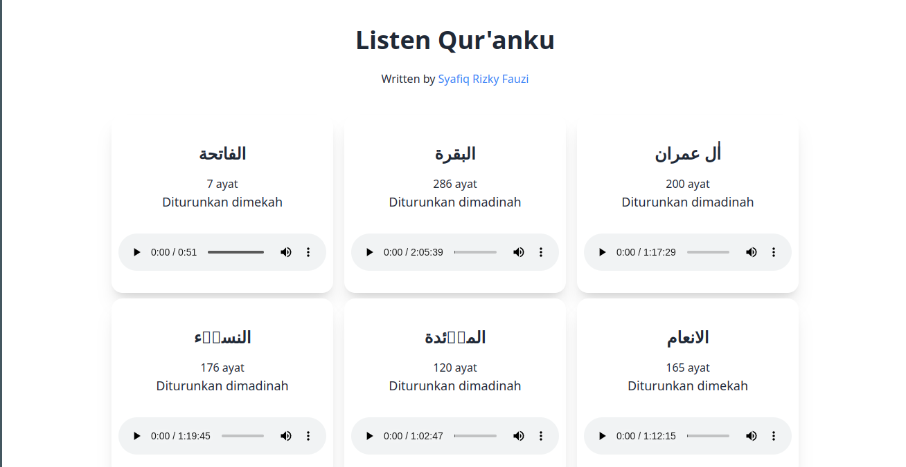

# Listen Qur'anku


## Introduction
Listen Qur'anku is a web application that allows you to listen to the Qur'an in Indonesian and English. This application is made with the purpose of helping people who want to listen to the Qur'an but don't have the time to read it.

## Tech Stack
- Next.js
- Tailwind CSS
- DaisyUI
- Al-Qur'an API dari [equran](https://equran.id/)

## Installation
1. Clone this repository
2. Install dependencies
```bash
npm install
# or
yarn install
```
3. Run the development server
```bash
npm run dev
# or
yarn dev
```
4. Open [http://localhost:3000](http://localhost:3000) with your browser to see the result.


